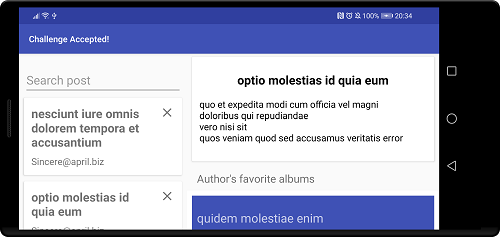

PostBrowser
=========
Sample Kotlin project using MVVM with clean architecture, data binding, Hilt and flows.

# Architecture

Clean architecture layers
-----------
- `app`: contains view and presentation layers; main layer with framework dependencies; split per feature; depends on domain
- `domain`: business logic layer, do not depent on any other layer
  - use cases - BL logic is encapsulated in single interactor/use-case class responsible for one thing only
  - models - definition of domain model
  - interfaces of Repository - by being defined in domain layer we can make domain layer independent from data implementation and satisfy dependecny inversion principle
- `data` self explenatory, depends on domain, implement domain repository
  - db - room database with relationships
  - network - api/services
  - repository - depends on db and network layer 
  - mappers from db entitty/ api responses to domain models

UI
-----------
Application uses single activity approach with two fragments: master/details. I've set boundary for entering dual pane view at -w550dp, so on phone landscape mode will already be presented as dual pane, portrait still as single pane. For Post list I used Paging Library.

MVVM
-----------
MVVM is based on Android Architecture Components and data binding. ViewModels expose LiveData/flows either to xml (via data binding) or to Fragments using lifecycle-aware observable. ViewModels don't have other Android dependencies except form Architecture Components to allow better tests and layer separation.
Flow are used to benefit from both steames support and convenient threading using coroutines.

Libraries
-----------
- Hilt as DI
- Retrofit2/Okhttp/Gson for networking
- Jetpack Paging 3.0 for ... paging ;)
- Glide for loading and caching photos
- Room as database
- Facebook Shimmer for fancy loading 
- Timber for logging

# Tests

Unit tests:
-----------
Tests fallows given/when/then pattern. Written in junit5 and extensively uses Mockk

Android tests:
-----------
- end-to-end test
- fragments test
- database tests

Note: Because of time constraints I did not manage to fully cover app with tests. However testable architecture is prepared and many of them are written to show style and patterns I'm typically using.

# Assumptions
- In database I've preserved only part of fetched api responses needed by application
- In point 6. of instruction there is a statement about master view being 'always' visible. Having it visible in Portrait mode alongside detail view does not make much sense on small devices. I assumed that master/detail should work as per material design - single pane when screen is not wide, dual pane once it's wide. I set boundary at -w550dp, so on phone landscape mode will be already dual pane, portrait single pane.
- I’ve assumed that proper architecture, showcase of technology, error handling and testability are much more important to present in this assessment then fancy UI. Therefore I keep UI quite minimalistic

Note: in production project I would consult doubts with designer, PO or/and BI. Current code is written in the way that potential changes should be easy to make

Usage of experimental API:
-----------
In order to make coding challenge as fun as possible I've used brand new libs, still not ready for production:
- experimental coroutines API, including StateFlows ('hot' flows) and coroutines-testing
- Paging 3.0 alpha, with support for flows
- Hilt alpha version
